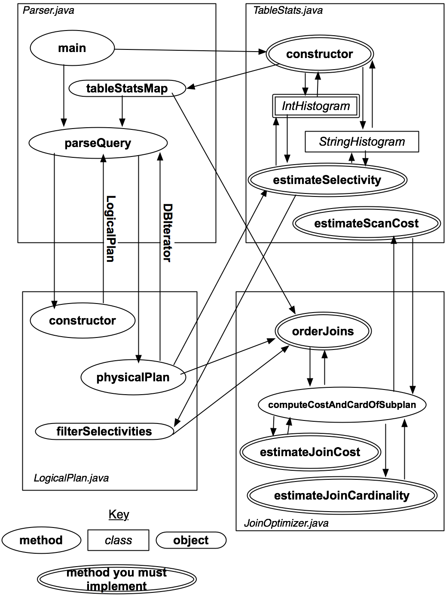

# 6.830 Lab 3: Query Optimization

**Assigned: Wednesday, Mar 17, 2021**<br>
**Due: Tuesday, Apr 6, 2021**

In this lab, you will implement a query optimizer on top of SimpleDB.
The main tasks include implementing a selectivity estimation framework
and a cost-based optimizer. You have freedom as to exactly what you
implement, but we recommend using something similar to the Selinger
cost-based optimizer discussed in class (Lecture 9).

在本实验中，您将在SimpleDB之上实现一个查询优化器。主要任务包括实现一个选择性估计框架和一个基于成本的优化器。您可以自由选择具体实现什么，但我们建议您使用类似于课堂上讨论的基于Selinger成本的优化器（第9讲）。

The remainder of this document describes what is involved in
adding optimizer support and provides a basic outline of how
you do so.

As with the previous lab, we recommend that you start as early as possible.


##  1. Getting started

You should begin with the code you submitted for Lab 2. (If you did not
submit code for Lab 2, or your solution didn't work properly, contact us to
discuss options.)

We have provided you with extra test cases as well
as source code files for this lab
that are not in the original code distribution you received. We again encourage you
to develop your own test suite in addition to the ones we have provided.

You will need to add these new files to your release. The easiest way
to do this is to change to your project directory (probably called simple-db-hw)
and pull from the master GitHub repository:

```
$ cd simple-db-hw
$ git pull upstream master
```

### 1.1. Implementation hints
We suggest exercises along this document to guide your implementation, but you may find that a different order makes
more sense for you. As before, we will grade your assignment by looking at your code and
verifying that you have passed the test for the ant targets <tt>test</tt> and
<tt>systemtest</tt>. See Section 3.4 for a complete discussion of grading and the tests you will need to pass.

Here's a rough outline of one way you might proceed with this lab. More details on these
steps are given in Section 2 below.

*  Implement the methods in the <tt>TableStats</tt> class that allow
   it to estimate selectivities of filters and cost of
   scans, using histograms (skeleton provided for the <tt>IntHistogram</tt> class) or some
   other form of statistics of your devising.
*  在<tt>TableStats</tt>类中实现方法，使用直方图（为<tt>IntHistogram</tt>类提供的框架）或您设计的其他形式的统计数据来估计过滤器的选择性和扫描的成本
*  Implement the methods in the <tt>JoinOptimizer</tt> class that
   allow it to estimate the cost and selectivities of joins.
*  Write the <tt>orderJoins</tt> method in <tt>JoinOptimizer</tt>. This method must produce
   an optimal ordering for a series of joins (likely using the
   Selinger algorithm), given statistics computed in the previous two steps.
*  *实现<tt>JoinOptimizer</tt>类中的方法，允许它估计连接的成本和选择性。*在<tt>JoinOptimizer</tt>中写入<tt>orderJoins</tt>方法。根据前两步计算的统计数据，该方法必须为一系列连接生成最优排序（可能使用Selinger算法）
##  2. Optimizer outline

Recall that the main idea of a cost-based optimizer is to:

*  Use statistics about tables to estimate "costs" of different
   query plans.  Typically, the cost of a plan is related to the  cardinalities of
   (number of tuples produced by) intermediate joins and selections, as well as the
   selectivity of filter and join predicates.
*  Use these statistics to order joins and selections in an
   optimal way, and to select the best implementation for join
   algorithms from amongst several alternatives.

In this lab, you will implement code to perform both of these
functions.

The optimizer will be invoked from <tt>simpledb/Parser.java</tt>.  You may wish
to review the <a href="https://github.com/MIT-DB-Class/simple-db-hw-2021/blob/master/lab2.md#27-query-parser">lab 2 parser exercise</a>
before starting this lab.  Briefly, if you have a catalog file
<tt>catalog.txt</tt> describing your tables, you can run the parser by
typing:
```
java -jar dist/simpledb.jar parser catalog.txt
```

When the Parser is invoked, it will compute statistics over all of the
tables (using statistics code you provide). When a query is issued,
the parser
will convert the query into a logical plan representation and then call
your query optimizer to generate an optimal plan.

### 2.1 Overall Optimizer Structure
Before getting started with the implementation, you need to understand the overall structure of the SimpleDB
optimizer.  The overall control flow of the SimpleDB modules of the parser and optimizer is shown in Figure 1.

<p align="center">
<br>
<i>Figure 1: Diagram illustrating classes, methods, and objects used in the parser</i>
</p>


The key at the bottom explains the symbols; you
will implement the components with double-borders.  The classes and
methods will be explained in more detail in the text that follows (you may wish to refer back
to this diagram), but
the basic operation is as follows:

1. <tt>Parser.java</tt> constructs a set of table statistics (stored in the
   <tt>statsMap</tt> container) when it is initialized.  It then waits for a
   query to be input, and calls the method <tt>parseQuery</tt> on that query.
2. <tt>Parser.java</tt> 在初始化时构建一组表统计信息（存储在 <tt>statsMap</tt> 容器中）。然后它等待输入查询，并对该查询调用 <tt>parseQuery</tt> 方法
3. <tt>parseQuery</tt> first constructs  a <tt>LogicalPlan</tt> that
   represents the parsed query. <tt>parseQuery</tt> then calls the method <tt>physicalPlan</tt> on the
   <tt>LogicalPlan</tt> instance it has constructed.  The <tt>physicalPlan</tt> method returns a
   <tt>DBIterator</tt> object that can be used to actually run the query.
4. parseQuery 首先构建一个表示解析后查询的 LogicalPlan。然后，parseQuery 对它构建的 LogicalPlan 实例调用 physicalPlan 方法。physicalPlan 方法返回一个 DBIterator 对象，该对象可用于实际执行查询。

In the exercises to come, you will implement the methods that help
<tt>physicalPlan</tt> devise an optimal plan.

在接下来的练习中，你将实现帮助 physicalPlan 设计一个最优计划的方法。

### 2.2. Statistics Estimation
Accurately estimating plan cost is quite tricky.  In this lab, we will
focus only on the cost of sequences of joins and base table accesses.  We
won't worry about access method selection (since we only have one
access method, table scans) or the costs of additional operators (like
aggregates).

You are only required to consider left-deep plans for this lab. See
Section 2.3 for a description of additional "bonus" optimizer features
you might implement, including an approach for handling bushy plans.

准确估计计划成本是相当棘手的。在这个实验中，我们将只关注连接序列和基表访问的成本。我们不需要担心访问方法的选择（因为我们只有一个访问方法，即表扫描），也不需要考虑额外操作符（如聚合）的成本。

对于这个实验，你只需要考虑左深计划。参见第2.3节，了解你可以实现的其他“奖励”优化器特性描述，包括处理丛状计划的方法。

####  2.2.1 Overall Plan Cost

We will write join plans of the form `p=t1 join t2 join ... tn`,
which signifies a left deep join where t1 is the left-most
join (deepest in the tree).
Given a plan like `p`, its cost
can be expressed as:

我们将编写形如 `p=t1 join t2 join ... tn` 的连接计划，这表示一个左深连接，其中 t1 是最左边的连接（在树中最深处）。
对于像 `p` 这样的计划，其成本可以表示为：

```
scancost(t1) + scancost(t2) + joincost(t1 join t2) +
scancost(t3) + joincost((t1 join t2) join t3) +
... 
```

Here, `scancost(t1)` is the I/O cost of scanning table t1,
`joincost(t1,t2)` is the CPU cost to join t1 to t2.  To
make I/O and CPU cost comparable, typically a constant scaling factor
is used, e.g.:

```
cost(predicate application) = 1
cost(pageScan) = SCALING_FACTOR x cost(predicate application)
```

For this lab, you can ignore the effects of caching (e.g., assume that
every access to a table incurs the full cost of a scan) -- again, this
is something you may add as an optional bonus extension to your lab
in Section 2.3.  Therefore, `scancost(t1)` is simply the
number of pages in `t1 x SCALING_FACTOR`.

在这里，`scancost(t1)` 是扫描表 t1 的 I/O 成本，`joincost(t1,t2)` 是将 t1 与 t2 进行连接的 CPU 成本。为了使 I/O 成本和 CPU 成本可比较，通常会使用一个常数缩放因子，例如：

```
成本(谓词应用) = 1
成本(pageScan) = 缩放因子 x 成本(谓词应用)
```

对于这个实验，你可以忽略缓存的影响（即假设每次访问表都会产生完整的扫描成本）——这又是你可以在第2.3节中作为可选的奖励扩展添加到你的实验中的内容。因此，`scancost(t1)` 简单来说就是 `t1` 中的页数乘以缩放因子。

####  2.2.2 Join Cost

When using nested loops joins, recall that the cost of a join between
two tables t1 and t2 (where t1 is the outer) is
simply:

```
joincost(t1 join t2) = scancost(t1) + ntups(t1) x scancost(t2) //IO cost
                       + ntups(t1) x ntups(t2)  //CPU cost
```

Here, `ntups(t1)` is the number of tuples in table t1.

当使用嵌套循环连接时，记住两个表 t1 和 t2 之间的连接成本（其中 t1 是外层）简单来说是：

```
joincost(t1 join t2) = scancost(t1) + ntups(t1) x scancost(t2) // I/O 成本
                       + ntups(t1) x ntups(t2)  // CPU 成本
```

这里，`ntups(t1)` 是表 t1 中的元组数量。

####  2.2.3 Filter Selectivity

`ntups` can be directly computed for a base table by
scanning that table.  Estimating `ntups` for a table with
one or more selection predicates over it can be trickier --
this is the *filter selectivity estimation* problem.  Here's one
approach that you might use, based on computing a histogram over the
values in the table:

*  Compute the minimum and maximum values for every attribute in the table (by scanning
   it once).
*  Construct a histogram for every attribute in the table. A simple
   approach is to use a fixed number of buckets *NumB*,
   with
   each bucket representing the number of records in a fixed range of the
   domain of the attribute of the histogram.  For example, if a field
   *f* ranges from 1 to 100, and there are 10 buckets, then bucket 1 might
   contain the count of the number of records between 1 and 10, bucket
   2 a count of the number of records between 11 and 20, and so on.
*  `ntups` 可以通过扫描基础表直接计算得出。对于带有一个或多个选择谓词的表，估计 `ntups` 可能会更复杂——这就是*过滤选择性估计*问题。这里有一个基于计算表中值的直方图的方法，你可能会使用：
   * 计算表中每个属性的最小值和最大值（通过扫描一次表）。
   * 为表中的每个属性构建一个直方图。一个简单的方法是使用固定数量的桶 *NumB*，
     每个桶代表在属性域固定范围内的记录数。
     例如，如果字段 *f* 的范围是从 1 到 100，并且有 10 个桶，那么第 1 个桶可能包含 1 到 10 之间记录的数量，第 2 个桶包含 11 到 20 之间记录的数量，依此类推。
*  Scan the table again, selecting out all of fields of all of the
   tuples and using them to populate the counts of the buckets
   in each histogram.
*  To estimate the selectivity of an equality expression,
   *f=const*, compute the bucket that contains value *const*.
   Suppose the width (range of values) of the bucket is *w*, the height (number of
   tuples) is *h*,
   and the number of tuples in the table is *ntups*.  Then, assuming
   values are uniformly distributed throughout the bucket, the selectivity of
   the
   expression is roughly *(h / w) / ntups*, since *(h/w)*
   represents the expected number of tuples in the bin with value
   *const*.
*  再次扫描表，选择出所有元组的所有字段，并用它们来填充每个直方图中桶的计数。
* 为了估计等值表达式 *f=const* 的选择性，计算包含值 *const* 的桶。假设该桶的宽度（值的范围）是 *w*，高度（元组数量）是 *h*，表中的元组数量是 *ntups*。那么，假设值在桶内均匀分布，表达式的选择性大约是 *(h / w) / ntups*，因为 *(h/w)* 表示具有值 *const* 的桶中预期的元组数量。
*  To estimate the selectivity of a range expression *f>const*,
   compute the
   bucket *b* that *const* is in, with width *w_b* and height
   *h_b*.  Then, *b* contains a fraction <nobr>*b_f = h_b / ntups* </nobr>of the
   total tuples.  Assuming tuples are uniformly distributed throughout *b*,
   the fraction *b_part* of *b* that is *> const* is
   <nobr>*(b_right - const) / w_b*</nobr>, where *b_right* is the right endpoint of
   *b*'s bucket.  Thus, bucket *b* contributes *(b_f  x
   b_part)* selectivity to the predicate.  In addition, buckets
   *b+1...NumB-1* contribute all of their
   selectivity (which can be computed using a formula similar to
   *b_f* above).  Summing the selectivity contributions of all the
   buckets will yield the overall selectivity of the expression.
   Figure 2 illustrates this process.
*  为了估计范围表达式 *f>const* 的选择性，计算包含 *const* 的桶 *b*，其宽度为 *w_b*，高度为 *h_b*。那么，*b* 包含总元组数的分数 <nobr>*b_f = h_b / ntups*</nobr>。假设元组在 *b* 内均匀分布，*b* 中大于 *const* 的部分 *b_part* 是 <nobr>*(b_right - const) / w_b*</nobr>，其中 *b_right* 是 *b* 桶的右端点。因此，桶 *b* 对谓词的选择性贡献是 *(b_f x b_part)*。此外，桶 *b+1...NumB-1* 贡献了它们所有的选择性（可以使用类似于上面 *b_f* 的公式来计算）。将所有桶的选择性贡献相加，就会得到表达式的总体选择性。图2说明了这一过程。
*  Selectivity of expressions involving *less than* can be performed
   similar to the greater than case, looking at buckets down to 0.
*  涉及 *小于* 的表达式的选择性计算可以类似于大于的情况进行，只不过需要查看从当前桶到0号桶的范围。

<p align="center">
<br>
<i>Figure 2: Diagram illustrating the histograms you will implement in Lab 5</i>
</p>


In the next two exercises, you will code to perform selectivity estimation of
joins and filters.

***
**Exercise 1:  IntHistogram.java**

You will need to implement
some way to record table statistics for selectivity estimation.  We have
provided a skeleton class, <tt>IntHistogram</tt> that will do this.  Our
intent is that you calculate histograms using the bucket-based method described
above, but you are free to use some other method so long as it provides
reasonable selectivity estimates.

We have provided a class <tt>StringHistogram</tt> that uses
<tt>IntHistogram</tt> to compute selecitivites for String
predicates.  You may modify <tt>StringHistogram</tt> if you want to
implement a better estimator, though you should not need to in order to
complete this lab.

你需要实现某种方法来记录表的统计信息以进行选择性估计。我们提供了一个框架类 <tt>IntHistogram</tt> 来完成这个任务。我们的意图是让你使用上述基于桶的方法来计算直方图，但你也可以自由地使用其他方法，只要它能提供合理的选择性估计。

我们还提供了一个 <tt>StringHistogram</tt> 类，它使用 <tt>IntHistogram</tt> 来计算字符串谓词的选择性。如果你想实现一个更好的估计器，可以修改 <tt>StringHistogram</tt>，不过为了完成这个实验你并不需要这样做。完成这个练习后，你应该能够通过 <tt>IntHistogramTest</tt> 单元测试（如果你选择不实现基于直方图的选择性估计，则不需要通过此测试）。

After completing this exercise, you should be able to pass the
<tt>IntHistogramTest</tt> unit test (you are not required to pass this test if you
choose not to implement histogram-based selectivity estimation).

***
**Exercise 2:  TableStats.java**

The class <tt>TableStats</tt> contains methods that compute
the number of tuples and pages in a table and that estimate the
selectivity of predicates over the fields of that table.  The
query parser we have created creates one instance of <tt>TableStats</tt> per
table,  and passes these structures into your query optimizer (which
you will need in later exercises).

You should fill in the following methods and classes in <tt>TableStats</tt>:

类 <tt>TableStats</tt> 包含了计算表中元组数和页数的方法，以及估计该表字段上谓词选择性的方法。我们创建的查询解析器为每个表创建一个 <tt>TableStats</tt> 实例，并将这些结构传递给你的查询优化器（这将在后续练习中使用）。

你应该在 <tt>TableStats</tt> 中填充以下方法和类：。

*  Implement the <tt>TableStats</tt>  constructor:
   Once you have
   implemented a method for tracking statistics such as histograms, you
   should implement the <tt>TableStats</tt> constructor, adding code
   to scan the table (possibly multiple times) to build the statistics
   you need.
*   Implement <tt>estimateSelectivity(int field, Predicate.Op op,
    Field constant)</tt>: Using your statistics (e.g., an <tt>IntHistogram</tt>
    or <tt>StringHistogram</tt> depending on the type of the field), estimate
    the selectivity of predicate <tt>field op constant</tt> on the table.
*   实现`<tt>TableStats</tt>`构造函数：
    一旦你实现了一个用于跟踪统计数据（如直方图）的方法，你应该接着实现`<tt>TableStats</tt>`构造函数，在其中添加代码来扫描表（可能需要多次扫描），以构建你需要的统计数据。
    
    * 实现`<tt>estimateSelectivity(int field, Predicate.Op op, Field constant)</tt>`方法：
      使用你的统计数据（例如，根据字段类型使用`<tt>IntHistogram</tt>`或`<tt>StringHistogram</tt>`），估计给定表上谓词`field op constant`的选择性。
    
    选择性通常指的是满足特定条件的数据项占总数据项的比例。例如，如果你有一个整数字段，并且你想知道有多少记录的该字段值大于某个常量，你可以使用之前构建的直方图来估计这个比例，而不是实际去计算所有匹配的记录。这在查询优化中是非常有用的，因为它可以帮助决定最有效的执行计划。
*   Implement <tt>estimateScanCost()</tt>: This method estimates the
    cost of sequentially scanning the file, given that the cost to read
    a page is <tt>costPerPageIO</tt>.  You can assume that there are no
    seeks and that no pages are in the buffer pool.  This method may
    use costs or sizes you computed in the constructor.
*   Implement <tt>estimateTableCardinality(double
    selectivityFactor)</tt>: This method returns the number of tuples
    in the relation, given that a predicate with selectivity
    selectivityFactor is applied. This method may
    use costs or sizes you computed in the constructor.

You may wish to modify the constructor of <tt>TableStats.java</tt> to, for
example, compute histograms over the fields as described above for
purposes of selectivity estimation.

After completing these tasks you should be able to pass the unit tests
in <tt>TableStatsTest</tt>.

* 实现 estimateScanCost()：此方法估计顺序扫描文件的成本，假设读取一页的成本为 costPerPageIO。你可以假设没有寻道，并且缓冲池中没有任何页。此方法可以使用你在构造函数中计算的成本或大小。

* 实现 estimateTableCardinality(double selectivityFactor)：此方法返回关系中的元组数量，给定应用了选择性为 selectivityFactor 的谓词。此方法可以使用你在构造函数中计算的成本或大小。

你可能希望修改 TableStats.java 的构造函数，例如，为了选择性估计的目的，按照上面描述的那样计算字段上的直方图。

完成这些任务后，你应该能够通过 TableStatsTest 中的单元测试。

***

#### 2.2.4 Join Cardinality

Finally, observe that the cost for the join plan <tt>p</tt> above
includes expressions of the form <tt>joincost((t1 join t2) join
t3)</tt>.  To evaluate this expression, you need some way to estimate
the size (<tt>ntups</tt>) of <tt>t1 join t2</tt>.  This *join
cardinality estimation* problem is harder than the filter selectivity
estimation problem.  In this lab, you aren't required to do anything
fancy for this, though one of the optional excercises in Section 2.4
includes a histogram-based method for join selectivity estimation.

最后，请注意，上述连接计划 <tt>p</tt> 的成本包括形如 <tt>joincost((t1 join t2) join t3)</tt> 的表达式。为了评估这个表达式，你需要某种方法来估算 <tt>t1 join t2</tt> 的大小（即 ntups）。这个 连接基数估计 问题比过滤选择性估计问题更难。在这个实验中，你不需要为此做任何复杂的事情，尽管在第2.4节的一个可选练习中包含了一种基于直方图的方法来进行连接选择性估计


While implementing your simple solution, you  should keep in mind the following:

<!--  
  * <a name="change">The following three paragraphs are different in this version of the lab. </a> *
    .-->
*  For equality joins, when one of the attributes is a primary key, the number of tuples produced by the join cannot
   be larger than the cardinality of the non-primary key attribute.
* For equality joins when there is no primary key, it's hard to say much about what the size of the output
  is -- it could be the size of the product of the cardinalities of the tables (if both tables have the
  same value for all tuples) -- or it could be 0.  It's fine to make up a simple heuristic (say,
  the size of the larger of the two tables).
*  For range scans, it is similarly hard to say anything accurate about sizes.
   The size of the output should be proportional to
   the sizes of the inputs.  It is fine to assume that a fixed fraction
   of the cross-product is emitted by range scans (say, 30%).  In general, the cost of a range
   join should be larger than the cost of a non-primary key equality join of two tables
   of the same size.
* 对于等值连接（equality joins），当其中一个属性是主键时，连接产生的元组数量不能超过非主键属性的基数。
     对于没有主键的等值连接，很难准确预测输出的大小——它可能是两个表的基数乘积的大小（如果两个表的所有元组都有相同的值）——或者可能是0。你可以采用一个简单的启发式方法（例如，取两个表中较大的那个表的大小）。
     对于范围扫描（range scans），同样很难准确预测其大小。输出的大小应该与输入的大小成比例。可以假设范围扫描输出了交叉乘积的固定比例（例如，30%）。一般来说，范围连接的成本应该大于相同大小的两个表进行非主键等值连接的成本。


***
**Exercise 3:  Join Cost Estimation**


The class <tt>JoinOptimizer.java</tt> includes all of the methods
for ordering and computing costs of joins.  In this exercise, you
will write the methods for estimating the selectivity and cost of
a join, specifically:

*  Implement <tt>
   estimateJoinCost(LogicalJoinNode j, int card1, int card2, double
   cost1, double cost2)</tt>:  This method estimates the cost of
   join j, given that the left input is of cardinality card1, the
   right input of cardinality card2, that the cost to scan the left
   input is cost1, and that the cost to access the right input is
   card2.  You can assume the join is an NL join, and apply
   the formula mentioned earlier.
* 类 <tt>JoinOptimizer.java</tt> 包含了所有用于排序和计算连接成本的方法。在这个练习中，你将编写估计连接的选择性和成本的方法，具体来说：

   实现 <tt>estimateJoinCost(LogicalJoinNode j, int card1, int card2, double cost1, double cost2)</tt>：此方法估计连接 j 的成本，假设左输入的基数为 card1，右输入的基数为 card2，扫描左输入的成本为 cost1，访问右输入的成本为 cost2。你可以假设这是一个嵌套循环连接（NL join），并应用前面提到的公式。
*  Implement <tt>estimateJoinCardinality(LogicalJoinNode j, int
   card1, int card2, boolean t1pkey, boolean t2pkey)</tt>: This
   method estimates the number of tuples output by join j, given that
   the left input is size card1, the right input is size card2, and
   the flags t1pkey and t2pkey that indicate whether the left and
   right (respectively) field is unique (a primary key).
* 实现 <tt>estimateJoinCardinality(LogicalJoinNode j, int card1, int card2, boolean t1pkey, boolean t2pkey)</tt>：此方法估计连接 j 的输出元组数量，假设左输入的大小为 card1，右输入的大小为 card2，并且标志 t1pkey 和 t2pkey 分别指示左字段和右字段是否是唯一的（即主键）。

After implementing these methods, you should be able to pass the unit
tests <tt>estimateJoinCostTest</tt> and <tt>estimateJoinCardinality</tt> in <tt>JoinOptimizerTest.java</tt>.
***


###  2.3 Join Ordering

Now that you have implemented methods for estimating costs, you will
implement the Selinger optimizer.  For these methods, joins are
expressed as a list of join nodes (e.g., predicates over two tables)
as opposed to a list of relations to join as described in class.

Translating the algorithm given in lecture to the join node list form mentioned above, an outline in pseudocode would be:

现在已经实现了成本估算的方法，你将要实现Selinger优化器。对于这些方法，连接是通过一个连接节点列表（例如，两个表上的谓词）来表达的，而不是像课堂上描述的那样通过要连接的关系列表来表达。

将课上给出的算法转换为上述提到的连接节点列表形式，伪代码的大纲如下

```
1. j = set of join nodes
2. for (i in 1...|j|):
3.     for s in {all length i subsets of j}
4.       bestPlan = {}
5.       for s' in {all length d-1 subsets of s}
6.            subplan = optjoin(s')
7.            plan = best way to join (s-s') to subplan
8.            if (cost(plan) < cost(bestPlan))
9.               bestPlan = plan
10.      optjoin(s) = bestPlan
11. return optjoin(j)
```

给定一个连接的子集（`joinSet`）以及要从这个集合中移除的一个连接（`joinToRemove`），此方法计算将`joinToRemove`连接到`joinSet - {joinToRemove}`的最佳方式。它以`CostCard`对象的形式返回这个最佳方法，该对象包括成本、基数和最佳连接顺序（作为一个列表）。如果找不到计划（例如，因为不存在可能的左深连接），或者所有计划的成本都大于`bestCostSoFar`参数，则`computeCostAndCardOfSubplan`可能返回null。该方法使用了一个名为`pc`的先前连接缓存（上述伪代码中的`optjoin`），以便快速查找连接`joinSet - {joinToRemove}`的最快方式。其他参数（`stats`和`filterSelectivities`）被传递给您必须作为练习4的一部分实现的`orderJoins`方法，并在下面进行解释。此方法本质上执行了之前描述的伪代码中的第6-8行。

To help you implement this algorithm, we have provided several classes and methods to assist you.  First,
the method <tt>enumerateSubsets(List<T> v, int size)</tt> in <tt>JoinOptimizer.java</tt> will return
a set of all of the subsets of <tt>v</tt> of size <tt>size</tt>. This method is VERY inefficient for large
sets; you can earn extra credit by implementing a more efficient enumerator (hint: consider using an in-place
generation algorithm and a lazy iterator (or stream) interface to avoid materializing the entire power set).

Second, we have provided the method:

为了帮助你实现这个算法，我们提供了几个类和方法来辅助你。首先，在`JoinOptimizer.java`中的方法`enumerateSubsets(List<T> v, int size)`会返回`v`中大小为`size`的所有子集的集合。对于较大的集合来说，这个方法效率非常低；你可以通过实现一个更高效的枚举器来获得额外的学分（提示：考虑使用一种原地生成算法以及惰性迭代器（或流）接口，以避免将整个幂集实体化）。

其次，我们还提供了以下方法：

```java
    private CostCard computeCostAndCardOfSubplan(Map<String, TableStats> stats, 
                                                Map<String, Double> filterSelectivities, 
                                                LogicalJoinNode joinToRemove,  
                                                Set<LogicalJoinNode> joinSet,
                                                double bestCostSoFar,
                                                PlanCache pc) 
```

Given a subset of joins (<tt>joinSet</tt>), and a join to remove from
this set (<tt>joinToRemove</tt>), this method computes the best way to
join <tt>joinToRemove</tt> to <tt>joinSet - {joinToRemove}</tt>. It
returns this best method in a <tt>CostCard</tt> object, which includes
the cost, cardinality, and best join ordering (as a list).
<tt>computeCostAndCardOfSubplan</tt> may return null, if no plan can
be found (because, for example, there is no left-deep join that is
possible), or if the cost of all plans is greater than the
<tt>bestCostSoFar</tt> argument.  The method uses a cache of previous
joins called <tt>pc</tt> (<tt>optjoin</tt> in the psuedocode above) to
quickly lookup the fastest way to join <tt>joinSet -
{joinToRemove}</tt>.    The other arguments (<tt>stats</tt> and
<tt>filterSelectivities</tt>) are passed into the <tt>orderJoins</tt>
method that you must implement as a part of Exercise 4, and are
explained below.  This method essentially performs lines 6--8 of the
psuedocode described earlier.

Third, we have provided the method:

给定一个连接的子集（`joinSet`）以及要从这个集合中移除的一个连接（`joinToRemove`），此方法计算将`joinToRemove`连接到`joinSet - {joinToRemove}`的最佳方式。它以`CostCard`对象的形式返回这个最佳方法，该对象包括成本、基数和最佳连接顺序（作为一个列表）。如果找不到计划（例如，因为不存在可能的左深连接），或者所有计划的成本都大于`bestCostSoFar`参数，则`computeCostAndCardOfSubplan`可能返回null。该方法使用了一个名为`pc`的先前连接缓存（上述伪代码中的`optjoin`），以便快速查找连接`joinSet - {joinToRemove}`的最快方式。其他参数（`stats`和`filterSelectivities`）被传递给您必须作为练习4的一部分实现的`orderJoins`方法，并在下面进行解释。此方法本质上执行了之前描述的伪代码中的第6-8行。

第三，我们还提供了以下方法：

```java
    private void printJoins(List<LogicalJoinNode> js, 
                           PlanCache pc,
                           Map<String, TableStats> stats,
                           Map<String, Double> selectivities)
```

This method can be used to display a graphical representation of a join plan (when the "explain" flag is set via
the "-explain" option to the optimizer, for example).

Fourth, we have provided a class <tt>PlanCache</tt> that can be used

此方法可用于显示连接计划的图形表示（例如，当通过优化器的“-explain”选项设置“explain”标志时）。

第四，我们提供了一个`PlanCache`类，可用于缓存到目前为止在你实现Selinger过程中所考虑的连接子集的最佳连接方式（使用`computeCostAndCardOfSubplan`方法时需要此类的一个实例）。

to cache the best way to join a subset of the joins considered so far
in your implementation of Selinger (an instance of this class is
needed to use <tt>computeCostAndCardOfSubplan</tt>).


***
**Exercise 4:  Join Ordering**


In <tt>JoinOptimizer.java</tt>, implement the method:
```java
  List<LogicalJoinNode> orderJoins(Map<String, TableStats> stats, 
                   Map<String, Double> filterSelectivities,  
                   boolean explain)
```

This method should operate on the <tt>joins</tt> class member,
returning a new List that specifies the order in which joins
should be done.  Item 0 of this list indicates the left-most,
bottom-most join in a left-deep plan.  Adjacent joins in the
returned list should share at least one field to ensure the plan
is left-deep.  Here <tt>stats</tt> is an object that lets you find
the <tt>TableStats</tt> for a given table name that appears in the
<tt>FROM</tt> list of the query.  <tt>filterSelectivities</tt>
allows you to find the selectivity of any predicates over a table;
it is guaranteed to have one entry per table name in the
<tt>FROM</tt> list.  Finally, <tt>explain</tt> specifies that you
should output a representation of the join order for informational purposes.

该方法应对joins类成员进行操作，并返回一个新的列表，指定应执行连接的顺序。列表中的第0项指示在左深计划中最左侧和最底端的连接。返回列表中相邻的连接应至少共享一个字段，以确保计划为左深结构。这里stats是一个对象，它让你能够根据查询FROM子句中出现的表名找到相应的TableStats。filterSelectivities使你可以找到任何关于表的谓词的选择性；它保证了FROM子句中每个表名都有一条记录。最后，explain参数指明你应该出于说明的目的输出连接顺序的表示。

You may wish to use the helper methods and classes described above to assist
in your implementation. Roughly, your implementation should follow
the psuedocode above, looping through subset sizes, subsets, and
sub-plans of subsets, calling <tt>computeCostAndCardOfSubplan</tt> and
building a <tt>PlanCache</tt> object that stores the minimal-cost
way to perform each subset join.

After implementing this method, you should be able to pass all the unit tests in
<tt>JoinOptimizerTest</tt>.  You should also pass the system test
<tt>QueryTest</tt>.

你可能希望使用上面描述的帮助方法和类来协助你的实现。大体上，你的实现应当按照上述伪代码进行，循环遍历子集大小、子集以及子集的子计划，调用computeCostAndCardOfSubplan并且构建一个PlanCache对象，该对象用来存储执行每个子集连接的最低成本方式。

完成此方法的实现后，你应该能够通过JoinOptimizerTest中的所有单元测试。你也应该能够通过系统测试QueryTest。

###  2.4 Extra Credit

In this section, we describe several optional excercises that you may
implement for extra credit.  These are less well defined than the
previous exercises but give you a chance to show off your mastery of
query optimization! Please clearly mark which ones you have chosen to complete in your report,
and briefly explain your implementation and present your results (benchmark numbers, experience reports, etc.)

***
**Bonus Exercises.** Each of these bonuses is worth up to 5% extra credit:

*  *Add code to perform more advanced join cardinality estimation*.
   Rather than using simple heuristics to estimate join cardinality,
   devise a more sophisticated algorithm.
    - One option is to use joint histograms between
  every pair of attributes *a* and *b* in every pair of tables *t1* and *t2*.
  The idea is to create buckets of *a*, and for each bucket *A* of *a*, create a
  histogram of *b* values that co-occur with *a* values in *A*.
    -  Another  way to estimate the cardinality of a join is to assume that each value in the smaller table has a matching value in the larger table. Then the formula for the join selectivity would be: 1/(*Max*(*num-distinct*(t1, column1), *num-distinct*(t2, column2))). Here, column1 and column2 are the join attributes.  The cardinality of the join is then the product of the cardinalities of *t1* and *t2* times the selectivity. <br>
*  *Improved subset iterator*.  Our implementation of
   <tt>enumerateSubsets</tt> is quite inefficient, because it creates
   a large number of Java objects on each invocation.  
   In this bonus exercise, you would improve the performance of
   <tt>enumerateSubsets</tt> so that your system could perform query
   optimization on plans with 20 or more joins (currently such plans
   takes minutes or hours to compute).
*  *A cost model that accounts for caching*.  The methods to
   estimate scan and join cost do not account for caching in the
   buffer pool.  You should extend the cost model to account for
   caching effects.  This is tricky because multiple joins are
   running simultaneously due to the iterator model, and so it may be
   hard to predict how much memory each will have access to using the
   simple buffer pool we have implemented in previous labs.
*  *Improved join algorithms and algorithm selection*.  Our
   current cost estimation and join operator selection algorithms
   (see <tt>instantiateJoin()</tt> in <tt>JoinOptimizer.java</tt>)
   only consider nested loops joins.  Extend these methods to use one
   or more additional join algorithms (for example, some form of in
   memory hashing using a <tt>HashMap</tt>).
*  *Bushy plans*.  Improve the provided <tt>orderJoins()</tt> and other helper
   methods to generate bushy joins.  Our query plan
   generation and visualization algorithms are perfectly capable of
   handling bushy plans;  for example, if <tt>orderJoins()</tt>
   returns the list (t1 join t2 ; t3 join t4 ; t2 join t3), this
   will correspond to a bushy plan with the (t2 join t3) node at the top.

***


You have now completed this lab.
Good work!

##  3. Logistics
You must submit your code (see below) as well as a short (2 pages, maximum)
writeup describing your approach.  This writeup should:

*  Describe any design decisions you made, including methods for selectivity estimation,
   join ordering, as well as any of the bonus exercises you chose to implement and how
   you implemented them (for each bonus exercise you may submit up to 1 additional page).
*  Discuss and justify any changes you made to the API.
*  Describe any missing or incomplete elements of your code.
*  Describe how long you spent on the lab, and whether there was anything
   you found particularly difficult or confusing.
*  Description of any extra credit implementation you have done.

###  3.1. Collaboration
This lab should be manageable for a single person, but if you prefer
to work with a partner, this is also OK.  Larger groups are not allowed.
Please indicate clearly who you worked with, if anyone, on your writeup.

###  3.2. Submitting your assignment
We will be using gradescope to autograde all programming assignments. You should have all been invited to the class
instance; if not, please let us know and we can help you set up. You may submit your code multiple times before the
deadline; we will use the latest version as determined by gradescope. Place the write-up in a file called
lab3-writeup.txt with your submission. You also need to explicitly add any other files you create, such as
new *.java files.

The easiest way to submit to gradescope is with `.zip` files containing your code. On Linux/MacOS, you can do so by
running the following command:

```bash
$ zip -r submission.zip src/ lab3-writeup.txt
```

<a name="bugs"></a>
###  3.3. Submitting a bug

SimpleDB is a relatively complex piece of code. It is very possible you are going to find bugs, inconsistencies, and bad, outdated, or incorrect documentation, etc.

We ask you, therefore, to do this lab with an adventurous mindset.  Don't get mad if something is not clear, or even wrong; rather, try to figure it out
yourself or send us a friendly email.

Please submit (friendly!) bug reports to <a href="mailto:6.830-staff@mit.edu">6.830-staff@mit.edu</a>.
When you do, please try to include:

* A description of the bug.
* A <tt>.java</tt> file we can drop in the
  `test/simpledb` directory, compile, and run.
* A <tt>.txt</tt> file with the data that reproduces the bug.  We should be
  able to convert it to a <tt>.dat</tt> file using `HeapFileEncoder`.

You can also post on the class page on Piazza if you feel you have run into a bug.


###  3.4 Grading
<p>75% of your grade will be based on whether or not your code passes the system test suite we will run over it. These tests will be a superset of the tests we have provided. Before handing in your code, you should make sure it produces no errors (passes all of the tests) from both  <tt>ant test</tt> and <tt>ant systemtest</tt>.

**Important:** before testing, gradescope will replace your <tt>build.xml</tt>, <tt>HeapFileEncoder.java</tt> and the
entire contents of the <tt>test</tt> directory with our version of these files. This means you cannot change the format
of <tt>.dat</tt> files!  You should also be careful changing our APIs. You should test that your code compiles the
unmodified tests.

You should get immediate feedback and error outputs for failed tests (if any) from gradescope after submission. The
score given will be your grade for the autograded portion of the assignment. An additional 25% of your grade will be
based on the quality of your writeup and our subjective evaluation of your code. This part will also be published on
gradescope after we finish grading your assignment.

We had a lot of fun designing this assignment, and we hope you enjoy hacking on it!